# Chroma Beauty SDK

<p align="center">
  <strong>移动端 AI 美颜 + 智能调色 SDK</strong><br />
  One-tap AI color grading, portrait protection and beauty retouching for mobile apps.
</p>

<p align="center">
  
  
  
  
</p>

Chroma Beauty SDK 是一套面向相机、修图、社交、婚恋、电商、活动摄影和人像工具类 App 的移动端影像处理 SDK。它不是简单滤镜合集，而是把 **AI 一键调色、人像保护、磨皮美白、去油光、美型、瘦身长腿、预览导出** 串成一条完整的商业级人像处理链路。

> 当前仓库用于 GitHub 展示和商务沟通。正式 SDK、模型权重、Demo App、接入文档和定制调参服务可单独交付。

---

## 效果预览

### Demo App 实机流程

<p align="center">
  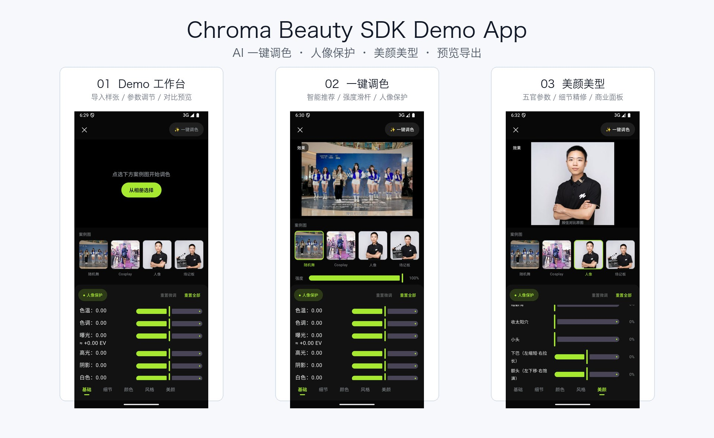
</p>

从 Demo 工作台到 AI 一键调色，再到美颜美型参数面板，展示的是一条面向真实 App 接入的完整链路：**导入样张 -> 智能推荐 -> 人像保护 -> 手动微调 -> 对比预览 -> 导出成片**。

<p align="center">
  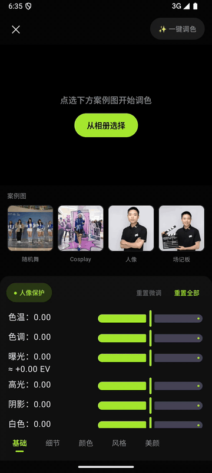
</p>

### Android Demo APK

> 这是 **安卓 Demo / Android Demo**，用于体验 Demo App 的界面流程和参数面板，不是正式 SDK 包。

- Release: [Chroma Beauty Android Demo v1.0.0](https://github.com/18818474455/ChromaBeautySDK/releases/tag/android-demo-v1.0.0)
- APK: [chroma-beauty-android-demo-v1.0.0.apk](https://github.com/18818474455/ChromaBeautySDK/releases/download/android-demo-v1.0.0/chroma-beauty-android-demo-v1.0.0.apk)
- Size: 163 MB
- SHA256: `ae427e479086410cf1befc935f93d613cb6f30459e9d81a43bc5008ac15c80e6`

### APK Demo 界面素材

| Demo 工作台 | AI 一键调色 | 美颜美型 |
|---|---|---|
| 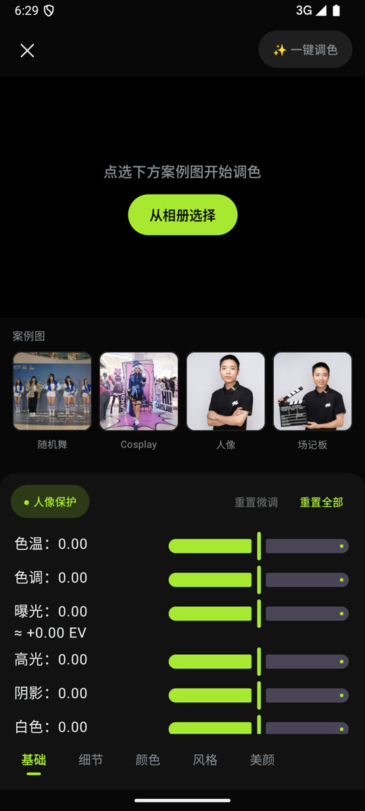 | 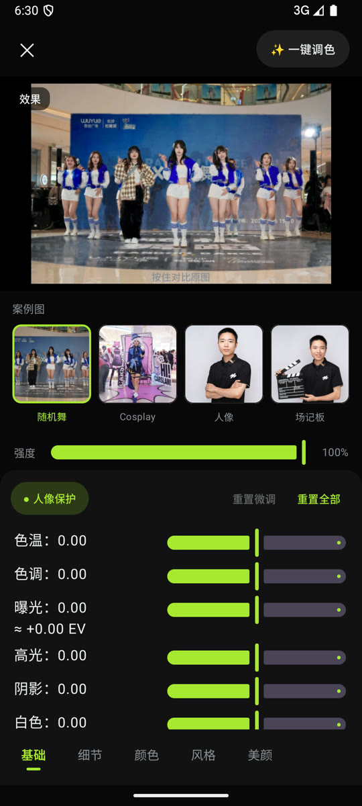 | 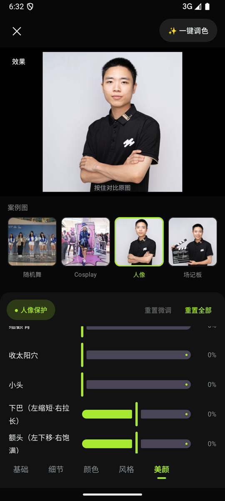 |

| 颜色面板 | 风格面板 |
|---|---|
| 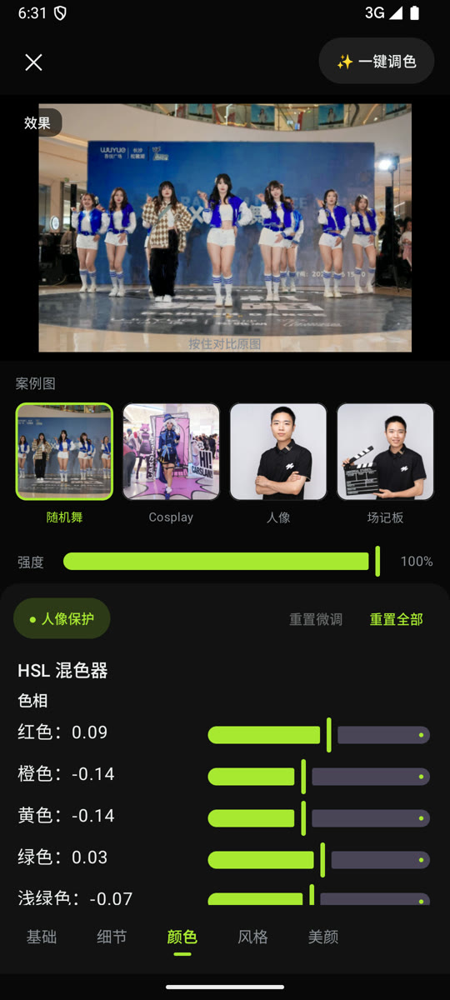 | 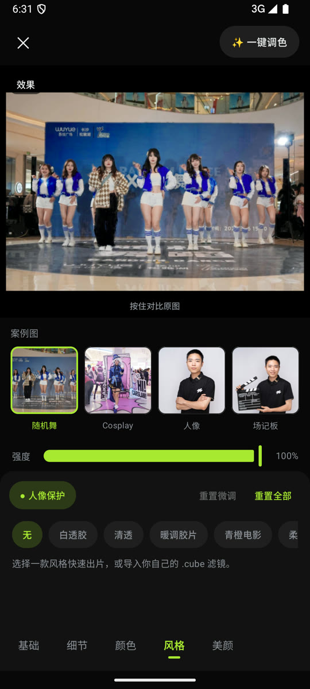 |

这些素材来自 Demo APK 的操作录屏与截图，适合用于 GitHub 首页、CSDN 文章、商务介绍页和 SDK 试用说明。当前仓库只展示产品能力和界面流程，不包含模型权重、正式 SDK 包或私有源码。

### 文章素材包

已经整理好中英文文章稿件，可用于 GitHub、CSDN、技术社区和商务介绍页：

- [中文文章 3 篇 + English articles 3 篇](articles/README.md)
- [Android Demo APK 下载说明](docs/ANDROID_DEMO.md)
- [海外版产品介绍稿](docs/GLOBAL_MARKET_ARTICLE.md)
- [配图顺序和公开展示边界](docs/ARTICLE_ASSETS.md)

### 操作动图

| AI 一键调色 + 人像保护 | 美颜面板 + 精修参数 |
|---|---|
| 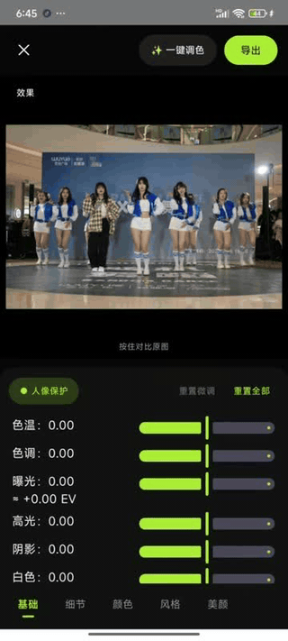 | 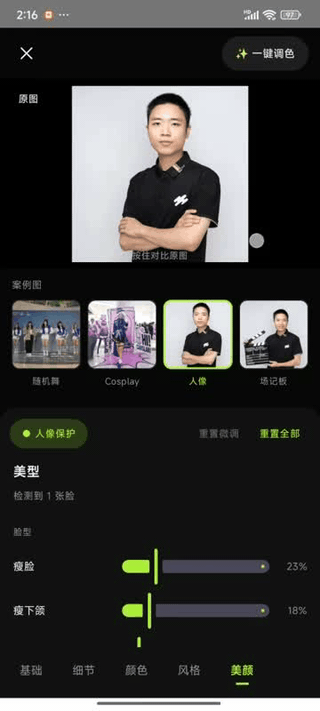 |

### 界面截图

| AI 一键调色 + 人像保护 | 美颜面板 + 精修参数 |
|---|---|
| 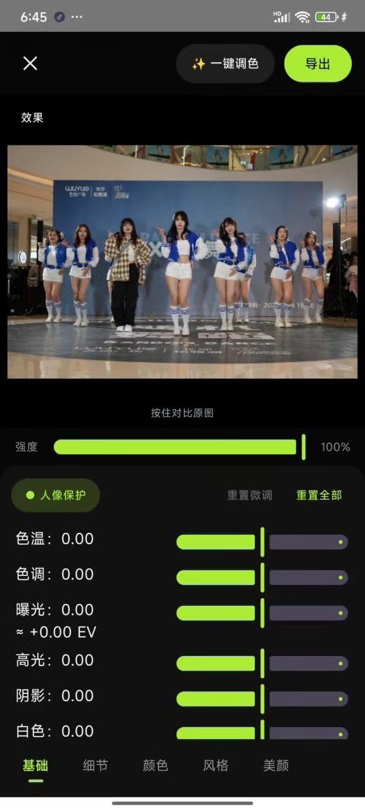 | 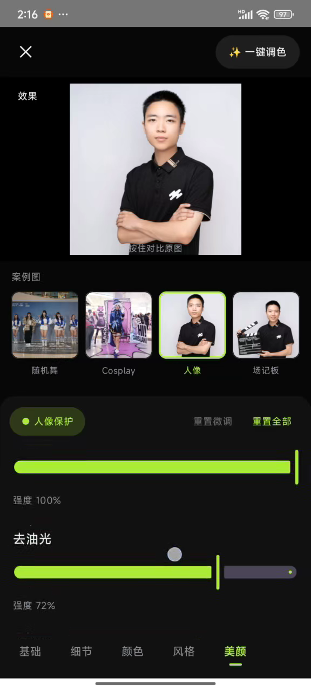 |

视频演示中的完整操作路径：

```text
导入图片
-> AI 一键调色
-> 开启人像保护
-> 基础 / 细节 / 颜色 / 风格 / 美颜参数微调
-> 长按对比原图
-> 导出成片
```

---

## 核心卖点

- **AI 一键调色**：自动分析照片，生成曝光、高光、阴影、色温、色调、自然饱和度、HSL、曲线、LUT 等组合参数。
- **人像保护**：背景可以增强氛围，人物肤色保持自然，避免脸部发红、发黄、发灰或过饱和。
- **AI 磨皮精修**：基于皮肤区域处理，不是全图糊化，尽量保留五官边缘、头发、衣服和背景细节。
- **完整美颜链路**：支持磨皮、美白、红润、去油光、黑眼圈、颈纹、美型、瘦身、长腿等常见商业美颜能力。
- **移动端优先**：面向 Android / iOS 的预览与导出工作流设计，可按机型做质量分档。
- **模块化接入**：既可以做完整修图工作台，也可以只接入调色、美颜或人像保护单模块。
- **商业交付友好**：可提供 SDK 包、Demo 工程、参数说明、预设方案、授权校验、模型保护和效果定制。

---

## 功能矩阵

### 1. AI Auto Color 一键调色

适合舞台照、活动合影、暗光自拍、商场路演、婚礼现场、电商人像等复杂场景。相比普通滤镜，一键调色会先理解画面，再输出一组可解释、可微调、可导出的参数。

支持方向：

| 能力 | 说明 |
|---|---|
| 基础光影 | 曝光、对比、高光、阴影、白色、黑色 |
| 色彩氛围 | 色温、色调、自然饱和度、饱和度 |
| 分区调色 | HSL / Color Mixer / 主色增强 |
| 风格化 | 曲线、LUT、胶片感、清透风格 |
| 安全控制 | 白衣保护、亮部保护、肤色保护、人像保护 |

### 2. Portrait Protection 人像保护

真实用户上传的照片经常是复杂背景、复杂光线、多人合影。Chroma 会把人物区域和背景区域分开处理，让背景更有氛围，同时尽量保证人物自然。

典型收益：

- 背景变通透，人物不被滤镜带偏。
- 蓝色舞台屏、绿色草地、暖色灯光不会过度污染肤色。
- 白色衣服和亮部区域更不容易被强色彩增强破坏。
- 多人合影里肤色更统一，观感更稳定。

### 3. AI Beauty Retouch 美颜精修

美颜不是把整张图拉糊，而是让每个效果只作用在该作用的位置。SDK 可结合皮肤区域、人体分割、脸部关键点和身体姿态，对皮肤、五官、脸型和身材分别处理。

| 模块 | 能力描述 |
|---|---|
| 磨皮 | 皮肤 ROI 精修，保留纹理和边缘 |
| 美白 | 皮肤区域亮度提升，软过渡避免假白 |
| 红润 | 独立肤色红润控制，避免白但没气色 |
| 去油光 | 额头、鼻梁、脸颊局部高光压自然 |
| 黑眼圈 | 眼下区域低频修复，尽量不破坏眼部细节 |
| 颈纹 | 颈部纹理柔化，保留轮廓阴影 |
| 美型 | 脸型、眼睛、鼻子、嘴巴、眉毛等几何调整 |
| 瘦身长腿 | 身体、手臂、腿部、比例调整 |

### 4. Preview / Export 预览导出一致

SDK 的处理链路可让预览和导出复用同一套参数，减少“预览好看、保存变样”的问题。拖动滑块时走快速预览，最终导出时走更高质量渲染。

---

## 平台支持

| 平台 | 状态 | 说明 |
|---|---|---|
| Android | 可接入 / 可演示 | Kotlin + Native 处理链路 |
| iOS | 可接入 / 可演示 | Swift Package / Framework 交付方向 |
| Flutter | 可定制 | 可封装 MethodChannel 插件 |
| Server Batch | 可定制 | 适合图片生产、批量修图、私有化部署 |

---

## 接入方式

### Full Workflow 完整修图工作流

适合从 0 搭建相机、修图、人像精修工具：

```text
图片输入 -> AI 分析 -> 一键调色 -> 美颜参数 -> 对比预览 -> 导出
```

### Modular Mode 模块化接入

适合已有编辑器 UI，只增强某一部分能力：

```text
只接一键调色
只接人像保护
只接 AI 磨皮
只接美型 / 瘦身
只接 LUT / HSL / 手动调节
```

更多接入示例见 [docs/INTEGRATION.md](docs/INTEGRATION.md)。

---

## 推荐 UI 分组

| 面板 | 推荐控件 |
|---|---|
| 基础 | 曝光、对比、高光、阴影、白色、黑色 |
| 细节 | 锐化、清晰度、纹理、降噪 |
| 颜色 | 色温、色调、自然饱和度、饱和度、HSL |
| 风格 | LUT 预设、风格强度、胶片/清透/人像风格 |
| 美颜 | 磨皮、美白、红润、去油光、黑眼圈、美型、瘦身、长腿 |

---

## 适用场景

- 美颜相机 / 自拍相机
- 图片编辑 / 滤镜修图 App
- 社交 / 婚恋 / 头像类产品
- 电商人像与模特图优化
- 婚礼、活动、会议照片快修
- 证件照、职业形象照、简历照
- 私有化图片生产系统
- AIGC 图片后处理与人像增强

---

## 商业交付内容

正式商业评估或项目接入可提供：

- Android AAR / iOS Framework 或 Swift Package
- Demo App 和示例工程
- API 文档与参数说明
- 常见场景推荐参数
- 模型与资源打包方案
- License 授权校验
- 版本升级与热更新方案
- 私有化部署与定制调参

商业说明见 [docs/COMMERCIAL.md](docs/COMMERCIAL.md)。

---

## 为什么选择 Chroma

Chroma 的定位不是“滤镜越多越好”，而是面向真实产品落地的端侧人像影像链路：

- 调色懂人像保护，背景好看但人不跑偏。
- 美颜懂区域控制，皮肤、五官、身体分层处理。
- AI 推荐和手动滑块共享同一条处理链路。
- 预览和导出使用同一套参数体系。
- 可按模块售卖，也可作为完整 SDK 交付。

---

## Contact

如需 SDK 试用、商务合作、商业授权、OEM 定制或效果调参，可以扫码联系。

<p align="center">
  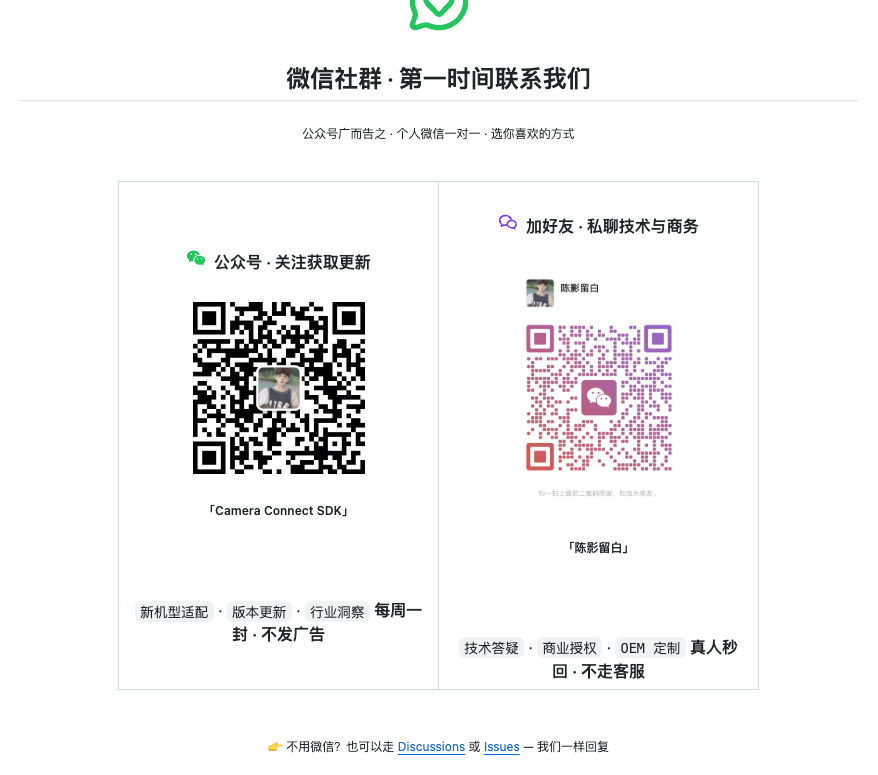
</p>

Email: [yunxiangchuanlaobiao@yunxiangchuan.cn](mailto:yunxiangchuanlaobiao@yunxiangchuan.cn)

也可以通过 GitHub Issue / Discussion 留下你的产品场景、目标平台、需要的功能模块和预计接入时间，我们会统一回复。

| 联系方式 | 适合场景 |
|---|---|
| Email | 海外客户、SDK 评估、商务合作、授权咨询 |
| 公众号 | 获取 SDK 更新、案例说明、版本动态 |
| 个人微信 | 技术答疑、商务授权、OEM 定制、私有化部署 |
| GitHub Issues | 接入问题、功能咨询、合作需求留档 |

---

## Notice

本仓库仅用于产品介绍和技术交流，不包含正式 SDK 二进制、模型权重、训练数据、私有源码、商业授权密钥或客户定制资料。
